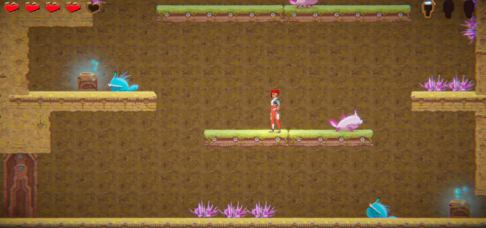
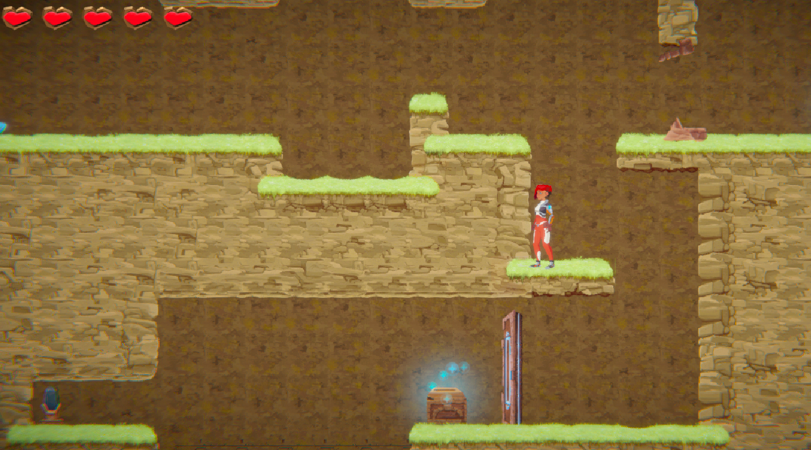
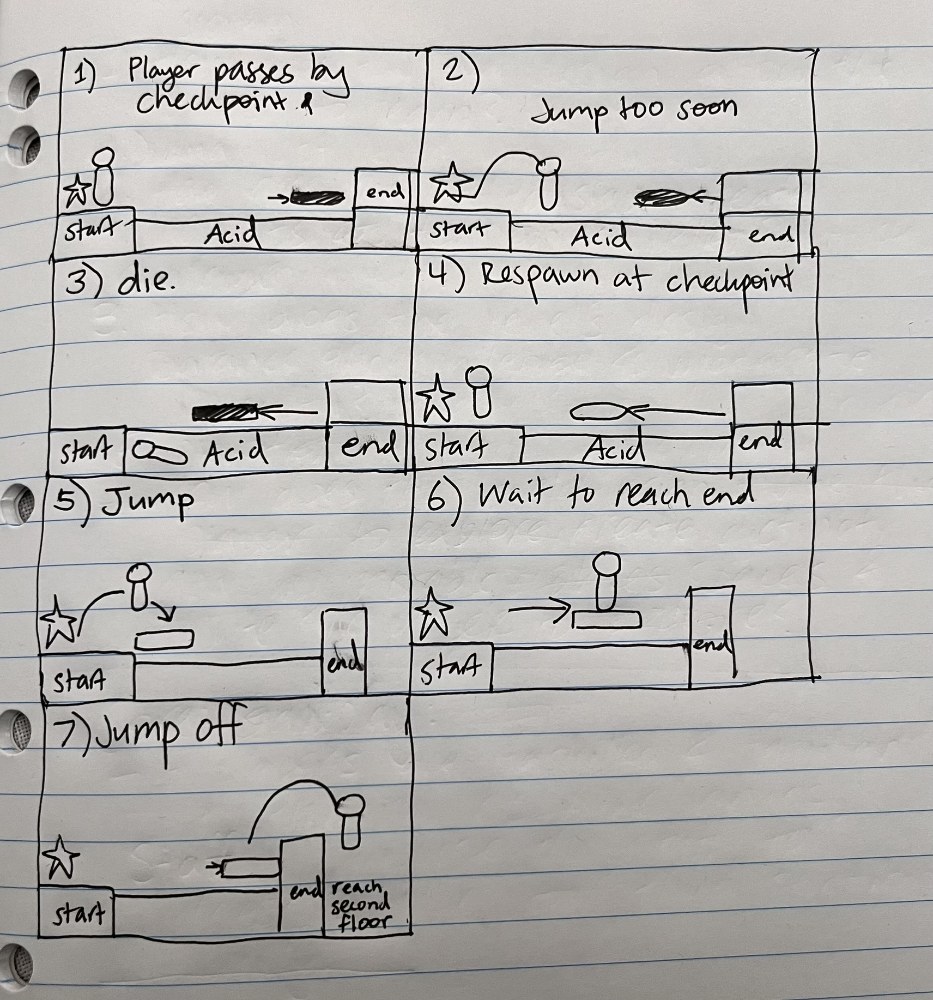
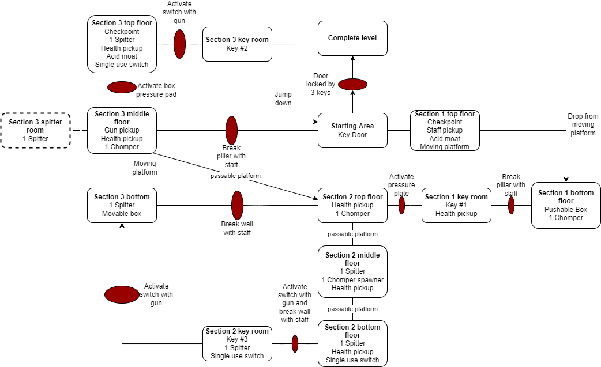
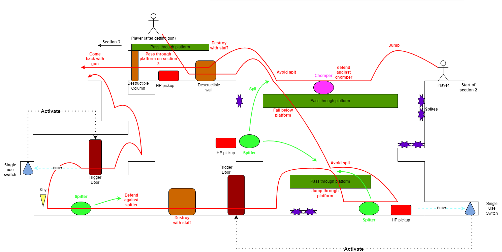

# COMP2150  - Level Design Document
### Name: [Inigo Willoughby]
### Student number: [47881445] 

## 1. Player Experience
### 1.1. Discovery

Out of the three sections in the level, the first section is the easiest and most straightforward, allowing the player to focus on learning the bulk of the main gameplay mechanics that are introduced in this section, namely the puzzle mechanics.

After the first section, the player's understanding of the game's controls and functions is tested in different ways, sometimes in combination. For example, after introducing the pushable box and moving platform in the first section, the third section requires the player to apply their knowledge on both of these mechanics by using the platform to move the box to a pressure pad.

Furthermore, a given mechanic may be used for multiple different puzzles. The aforementioned box is locked out of the player’s reach until they destroy a spitter standing on top of the pressure pad. The player does so by acquiring the gun and using the moving platform to get the right angle on the enemy, unlocking the door holding the box. This sequence of puzzles demonstrates how the level facilitates the player’s ability to apply their knowledge in different scenarios and use a singular element of the level for multiple puzzles.

### 1.2. Drama
The staff is placed such that the player cannot start section one without picking it up, which ensures that the singular Chomper enemy is a slight, but not drastic increase in intensity that familiarizes the player with the game's main combat mechanics.

The number of spitters in section two, when the player is only armed with a short-range staff as defense, makes it so the player is overwhelmed and moves on immediately to the third section, where they can find the gun needed to dispatch the spitters and to complete the puzzle that the spitters were previously blocking the player from. This means that the level’s intensity curve increase with the player’s progress.

The ‘key rooms’ at the end of each section provide the player with a moment of reprise, containing health kits that the player can use to recover any health lost from enemies. Furthermore, the reward found in these rooms, the keys, provide the player with a sense of accomplishment for their completion of that section’s challenges.

### 1.3. Challenge

The level is designed to challenge the player’s intellectual and perceptive capabilities. The level is designed such that the first section introduces the game's puzzle mechanics, and that the second section introduces combat mechanics, and from then, removes safeguards for the player in the third section, testing them on their familiarity with the game’s functions.

An example of this is the acid pit found in section three: unlike section one's acid pit, it doesn't have a moving platform, which makes it more of a challenge to cross, ultimately serving as a test of the player’s ability to move and jump with precision.

### 1.4. Exploration

The level is designed to have a degree of open-endedness in order to create a more dynamic experience for the player. This approach enables replayability for experienced players, and allows the player to complete the level in more comfortable way. The staff, for instance, found at the start of section one can be used to access section three early, allowing them to complete the sections in whichever order they want. 

The level also facilitates exploration through its metroidvania-style level progression. For instance, the key in the second section can’t be collected until the player acquires the gun found in the third section. Having encounters span across multiple sections through backtracking allows the sections to feel more dynamic and exciting for the player to explore. Furthermore, section two’s key room contains a path leading back to section three, which the player notices as they first enter section three. The discovery of multiple paths pique the player’s curiosity, in addition to making backtracking less tedious.

## 2. Core Gameplay (~400 words)

### 2.11. Weapon Pickup (Staff)

I wanted to create an open-ended level approach, by placing the staff at the entrance of section one, which allows the player to backtrack, break the column at the start, and access level three early. Furthermore, placing the staff there made it so the player would never encounter any enemies before acquiring it.

### 2.1. Acid, 2.2. Checkpoints, and 2.6. Moving platforms:

The checkpoint’s primary use was to respawn players after they fall into acid, which is why both are introduced together. Additionally, the moving platform was introduced in this encounter to give the player a way to cross, in order to introduce the player to a mechanic that isn’t dependent on their skill level.

### 2.3. Chompers and ###2.4. Health Pickups:

Given the chomper’s low strength compared to spitters, the player should be able to defeat it with ease. There is also a health kit to restore the player’s health should they get damaged by the chomper. This sequence introduces the player to the game’s combat mechanics, which they would need to engage with in the later sections.

### 2.5. Keys:

The first key the player collects is found after the completion of the relatively simple section one puzzle. This straightfoward encounter outlines the basic formula of the level’s sections to the player before they are thrust into the more open-ended areas of the level.

### 2.7. Passthrough Platforms and 2.8. Spikes:

Section two introduces the player to pass-through platforms, which opens up new ways for the player to traverse the level, and also spikes, which inhibit the directions in which the player can go. These two conflicting effects on the level force the player to think more strategically about how they move throughout the level.

### 2.9. Spitters and 2.10. Weapon Pickup (Gun):

Despite appearing earlier in section two, the spitters have a larger presence in section three, since the player is given the gun to fend them off, and thus encounters them more often. The sequence above depicts what would most likely be the first time the player engages with this type of enemy and its mechanics.

## 3. Spatiotemporal Design

 
### 3.1.    Molecule Diagram

### 3.2.    Level Map – Section 1

### 3.3.    Level Map – Section 2

### 3.4.    Level Map – Section 3

## 4. Iterative Design (~400 words)

Throughout the early stages of playtesting, the level was more linear, leading a strict path from right to left. Furthermore, the second section of the level was shorter and introduced both the chompers and the gun to the player, with the staff only being used for exploration purposes in the third section. 

In order to make the level more dynamic and fun to play with, the arrangement of these mechanics was changed drastically to offer a sense of open endedness.
For instance, section two was expanded upon by increasing the number of enemies, which providing a better challenge for the player. Realizing that this also added a natural barrier to the player’s progress if they were underprepared, I made it so the gun was located in the third section, and the player would have to backtrack to complete section two. This made the latter two sections feel more interconnected and thus more satisfying for the player to explore.

Furthermore, the staff’s location was changed so that the player acquired it at the start, and could use it to access the third section immediately. Not only did this create a sense of replayability, but it also utilized the staff’s capabilities for exploration more effectively than leaving it exclusively for the last section of the level.

When it came to designing the level design maps for each individual section, I noticed that the player would backtrack through the second section’s exit far too often, which made the level map hard to read. So, I created an alternative exit for section two that can only be unlocked from inside section 2’s key room. Furthermore, I made it so each key room contained at least one health kit in order to create a sense of relief when the player reached them, and to compensate for the large number of enemies and obstacles in section two.

I believe that further iterative design could improve the quality of the first section. Potential layout rearrangements and the implementation of more mechanics could make this section as open-ended as the other sections without sacrificing the simplicity needed to introduce the player to the level’s mechanics in a low-risk environment.

## Generative AI Use Acknowledgement

Generative AI was not used in the creation or documentation of this level.

